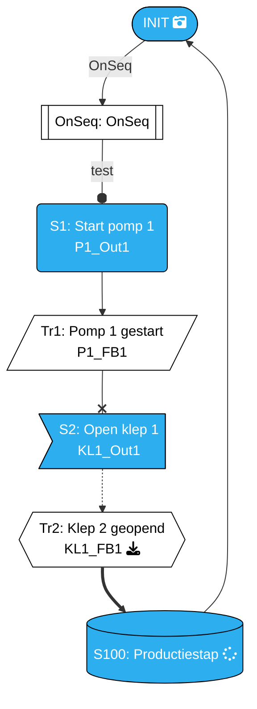
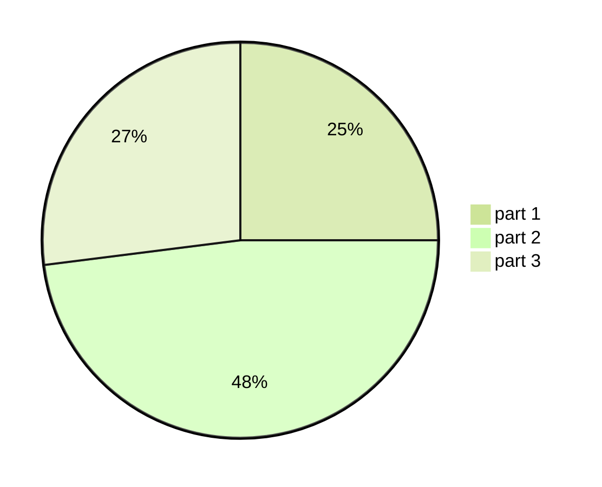
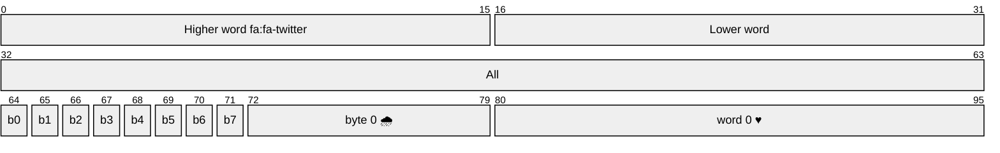

 TEST mermaid
>*On sequentie*

>**Start bij INIT**

Stopt bij ***Productiestap***

<!--
https://mermaid.js.org/syntax/flowchart.html#minimum-length-of-a-link
https://fontawesome.com/

-->

<!--
https://www.htmlsymbols.xyz/
-->

  