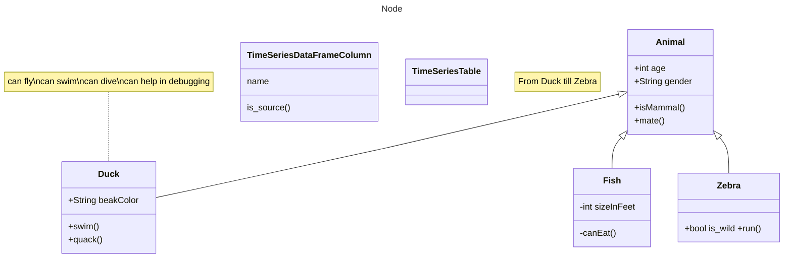

# Mermaid

```mermaid  
---
title: Node
---
classDiagram 
	note "From Duck till Zebra" 
	Animal <|-- Duck 
	note for Duck "can fly\ncan swim\ncan dive\ncan help in debugging" 
	Animal <|-- Fish 
	Animal <|-- Zebra 
	Animal : +int age 
	Animal : +String gender 
	Animal: +isMammal() 
	Animal: +mate() 
	class Duck{ 
		+String beakColor 
		+swim() 
		+quack() } 
	class Fish{ 
		-int sizeInFeet 
		-canEat() } 
	class Zebra{ 
		+bool is_wild +run() 
	}
	class TimeSeriesDataFrameColumn {
		name
		is_source()
	}
	class TimeSeriesTable {
	}
```
