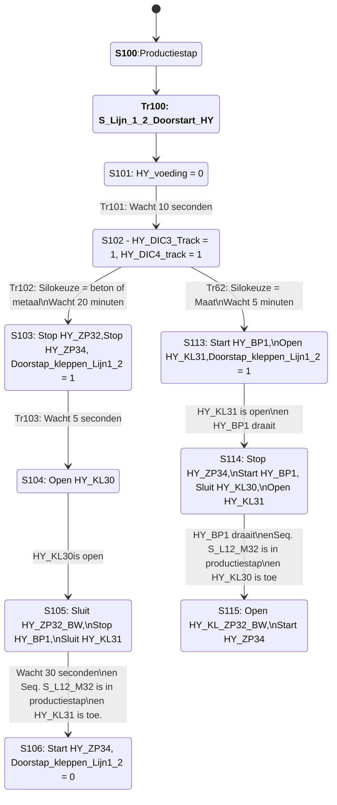
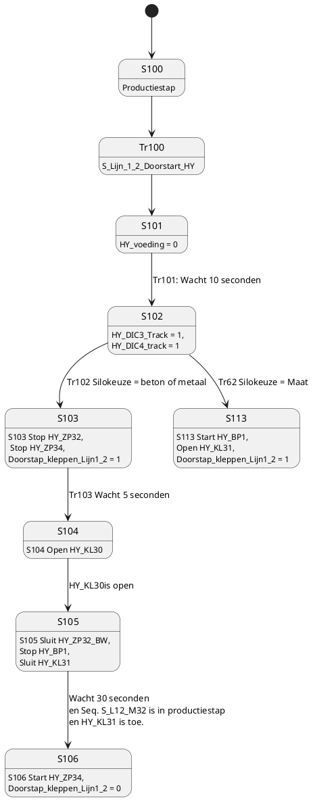

---
aliases:
tags:
  - Hydro
  - silos
date created: 2025-08-01
date modified: 2025-09-09
---
 ## Sequentie S_Seq_Lijn_1_2
- Stap 19, Stap29, Stap39, ...
	- Productiestap voor de verschillende silo keuzes
	- S_Lijn_1_2_Herstart = 1
	- Tr19, Tr29, Tr39, ...
		- Hoogniveau of doorstappen
	- Stap 548
		- Indien er gewisseld wordt van type bunker
			- S_Lijn_1_2_Herstart = 0
			- S_Lijn_1_2_Doorstart_HY = 1
			- S_L12_M32_Productiestap = 0
	- Tr 548
		- Wacht 2 seconden
	- Stap 549
		- S_Lijn_1_2_Doorstart_HY = 0
[[installations/des/Natzand/Hydro/processbeschrijving/Sequentie SEQ_Hydro_Lijn_1_2]]



	  
- Stap 100: Productiestap
- Tr100: S_Lijn_1_2_Doorstart_HY
- Stap 101: HY_voeding = 0
- Tr101: Wacht 10 seconden
- Stap 102:
	- HY_DIC3_Track = 1
	- HY_DIC4_Track = 1
- Tr102: Wacht 20 minuten, Tr62: Wacht 5 minuten
- Stap103
	- Stop [[installations/des/Natzand/Hydro/processbeschrijving/HY_ZP32]]
	- Stop [[installations/des/Natzand/Hydro/processbeschrijving/HY_ZP34]]
	- Doorstap_kleppen_Lijn1_2 = 1
- Stap104 ... Stap105, Stap114 ... Stap115
	- Start, Stop pompen
	- Open, Sluit kleppen

- Stap106, Stap116
	- Doorstap_kleppen_Lijn1_2 = 0
	- 




## HY_RS_Lijn_L1_2_Reset
- Is 0 tijdens stilstand
- Is 1 tijdens werking
  
```
  HY_RS_Lijn_L1_2_Reset:= (IaPar.HY_Z2.StatRun Or IaPar_Zeef_1.HY_Z1.StatRun) 
   					     And IaPar_ZP38.HY_ZP38.StatRun 
  				 And IaPar_Indikker_M34.HY_ZP33.StatRun 
  				 And IaPar_Silo.S_Lijn_1_2_Herstart 
  				 And Poc_L1_L2.HY_Voeding 
  				 And (
  						 (
  						   (IaPar_Silo.Keuze_Silo_Beton_L12 Or IaPar_Silo.Keuze_Silo_Metaal_L12) 
  						   And not IaPar_Pomptank_ZP34.SI_ST3.LTLLL.Act
  						 ) 
  						 Or (IaPar_Silo.Keuze_Silo_Maat_L12 
  						     And Not IaPar_Pomptank_ZP34.HY_ST25.LTLLL.Act)
  					  );
  ```
- ### Tijdens werking
  
HERNOEMEN NAAR L1_2_Voeding ?
	- 1 = Normale werking
	- 0 = zand / voeding af
		- HY_SS2.Select = 2, Ketel1: Regelkleppen onder sizer dicht
		- HY_SS3.Select = 2, Ketel1: Regelkleppen onder sizer dicht
		- HY_DIC4_Track
		- HY_DIC2_Track
		- HY_SS8.Select = 2, Ketel3 (voedingsklep dicht?)
		- HY_SS6.Select = 2, Ketel2 (voedingsklep dicht?)
## HY_DIC2_Track
```
HY_DIC2_Track := Poc_L1_L2.HY_DIC2_Track And IaPar_Pomptank_ZP38.HY_L1_L2_Auto Or               VoteOut.SI_ST3.Forward.LTLLL.Act And IaPar_Pomptank_ZP34.HY_KL30.StatOpen Or               IaPar_Pomptank_ZP34.HY_ZP34.StatStop Or Not IaPar_Zeef_2.HY_Herstart_L1_2_RS;
```
## HY_DIC4_Track
```
HY_DIC4_Track := Poc_L1_L2.HY_DIC4_Track And IaPar_Pomptank_ZP38.HY_L1_L2_Auto Or 
                     VoteOut.SI_ST3.Forward.LTLLL.Act And IaPar_Pomptank_ZP34.HY_KL30.StatOpen Or 
                     IaPar_Pomptank_ZP34.HY_ZP34.StatStop Or
                     Not IaPar_Zeef_2.HY_Herstart_L1_2_RS;
```
    

## Sequentie S_Seq_Lijn_3_4
- Stap 548
		- Indien er gewisseld wordt van type bunker
			- S_Lijn_3_4_Herstart = 0
			- S_Lijn_3_4_Doorstart_HY = 1
			- S_L34_M32_Productiestap = 0
## HY_Z2 - Zeef2

## HY_ZP38 - Zandpomp 38

- ## HY_ZP33 - Zandpomp 33
