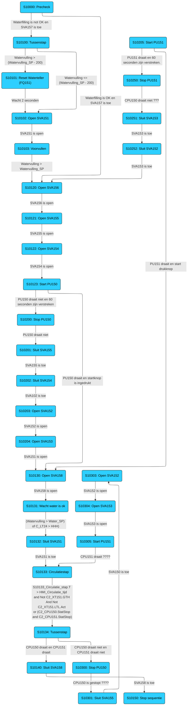

```mermaid
---
config:
  layout: elk
---

flowchart TB

%% bepaal classes
  classDef step fill: #2dcfff, stroke: #000000, color: #000000
    
S10000("S10000: Precheck "):::step
S10000 -- "Waterfilling is not OK en SVA157 is toe" --> S10100
S10000 -- "Waterfilling is OK en SVA157 is toe" --> S10120

S10100("S10100: Tussenstap"):::step
S10100 -- "Watervulling > (Watervulling_SP - 200)" --> S10101
S10100 -- "Watervulling <= (Watervulling_SP - 200)" --> S10102

S10101("S10101: Reset Waterteller (FQ151)"):::step
S10101 -- "Wacht 2 seconden" --> S10102

S10102("S10102: Open SVA151"):::step
S10102 -- "SVA151 is open" --> S10103

S10103("S10103: Voorvullen"):::step
S10103 -- "Watervulling > Watervulling_SP" --> S10120

S10120("S10120: Open SVA156"):::step
S10120 -- "SVA156 is open" --> S10121

S10121("S10121: Open SVA155"):::step
S10121 -- "SVA155 is open" --> S10122

S10122("S10122: Open SVA154"):::step
S10122 -- "SVA154 is open" --> S10123

S10123("S10123: Start PU150"):::step
S10123 -- "PU150 draait en startknop is ingedrukt" --> S10130
S10123 -- "PU150 draait niet en 60 seconden zijn verstreken" --> S10200

S10200("S10200: Stop PU150"):::step
S10200 -- "PU150 draait niet" --> S10201

S10201("S10201: Sluit SVA155"):::step
S10201 -- "SVA155 is toe" --> S10202

S10202("S10202: Sluit SVA154"):::step
S10202 -- "SVA102 is toe" --> S10203

S10203("S10203: Open SVA152"):::step
S10203 -- "SVA152 is open" --> S10204

S10204("S10204: Open SVA153"):::step
S10204 -- "SVA151 is open" --> S10130

S10205("S10205: Start PU151"):::step
S10205 -- "PU151 draait en start drukknop" --> S10130
S10205 -- "PU151 draait en 60 seconden zijn verstreken." --> S10250 

S10250("S10250: Stop PU151"):::step
S10250 -- "CPU150 draait niet ???" -->
S10251

S10251("S10251: Sluit SVA153"):::step
S10251 -- "SVA153 is toe" --> S10252

S10252("S10252: Sluit SVA152"):::step
S10252 -- "SVA153 is toe" --> S10120

S10130("S10130: Open SVA158"):::step
S10130 -- "SVA158 is open" --> S10131 

S10131("S10131: Wacht water is ok"):::step
S10131 -- "(Watervulling > Water_SP) of C_LT24 > HHH)" --> S10132

S10132("S10132: Sluit SVA151"):::step
S10132 -- "SVA151 is toe" --> S10133

S10133("S10133: Circulatiestap"):::step
S10133 -- "S10133_Circulatie_stap.T > HMI_Circulatie_tijd 
and Not C2_XT151.GTH 
And Not C2_XT151.LTL.Act 
or (C2_CPU150.StatStop and C2_CPU151.StatStop)" --> S10134

S10134("S10134: Tussenstap"):::step
S10134 -- "CPU150 draait en CPU151 draait" --> S10140
S10134 -- "CPU150 draait niet en CPU151 draait niet" --> S10300

S10300("S10300: Stop PU150"):::step
S10300 -- "CPU150 is gestopt ????" --> S10301

S10301("S10301: Sluit SVA155"):::step
S10301 -- "SVA150 is toe" --> S10303

S10303("S10303: Open SVA152"):::step
S10303 -- "SVA152 is open" --> S10304

S10304("S10304: Open SVA153"):::step
S10304 -- "SVA153 is open" --> S10305

S10305("S10305: Start PU151"):::step
S10305 -- "CPU151 draait ????" --> S10133

S10140("S10140: Sluit SVA158"):::step
S10140 -- "SVA158 is toe" --> S10150

S10150("S10150: Stop sequentie"):::step
```