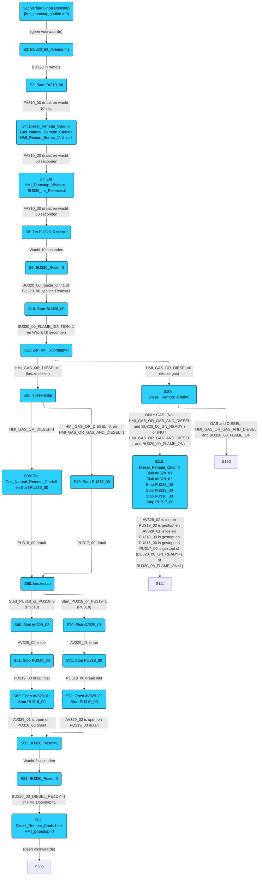

# Buttons and variables

| Tag                       | Value                           | Comment                                                |
| ------------------------- | ------------------------------- | ------------------------------------------------------ |
| BU320_Reset               |                                 |                                                        |
| BU320_00_DIESEL_READY     |                                 |                                                        |
| Diesel_Remote_Cmd         |                                 |                                                        |
| HMI_BURNER_VISIBLE        | /                               | Not used code                                          |
| HMI_GAS_OR_DIESEL         | 0 => Gas   1 => Diesel       | Button GAS of DIESEL   |
| HMI_GAS_OR_GAS_AND_DIESEL | 0 => Gas   1 => Gas + Diesel |                         |
| HMI_Doorstap              |                                 |                         |
| Gas_Natural_Remote_Cmd    |                                 |                         |
| Start_PU318_or_PU319      |                                 |                         |
