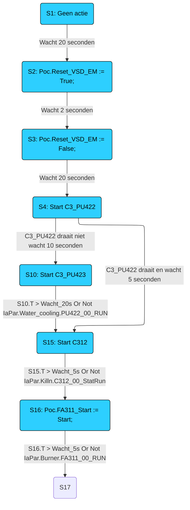
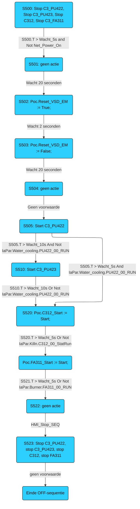

# Sequentie C3_Burner

## Start
ON-Sequentie start automatisch als: Gen_Power_on=1 EN Gen_Off=1 EN Net_Power_on=1

## Stop 
OFF-Sequentie start als: NET_Power_On=0 EN NET_Off=0

## ON-Sequentie

## OFF-Sequentie
