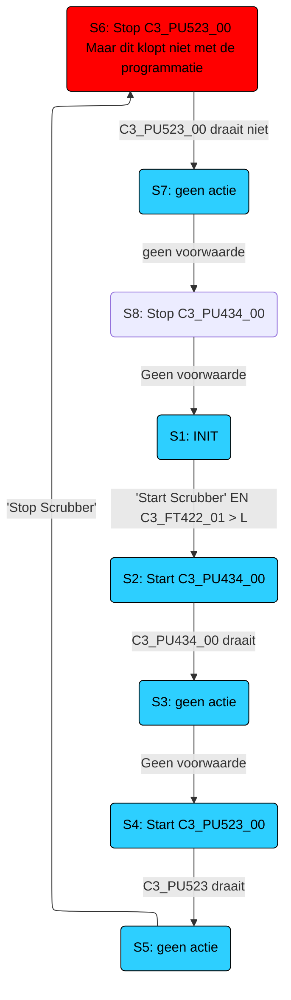

# Sequentie C3_SEQ_Scrubber

## Scrubber
Scubber wordt gestart in Stap2 van de [[C3_SEQ_Water_Cooling.pdf]] 

## Sequentie

```mermaid
---
config:
  layout: elk
---

flowchart TB

%% bepaal classes
  classDef step fill: #2dcfff, stroke: #000000, color: #000000
  classDef fout fill: #ff0000, stroke: #000000, color: #000000
    
S1("S1: INIT"):::step
S1 -- "'Start Scrubber' EN C3_FT422_01 > L" --> S2

S2("S2: Start C3_PU434_00"):::step
S2 -- "C3_PU434_00 draait" --> S3

S3("S3: geen actie"):::step
S3 -- "Geen voorwaarde" --> S4

S4("S4: Start C3_PU523_00"):::step
S4 -- "C3_PU523 draait" --> S5

S5("S5: geen actie"):::step
S5 -- "'Stop Scrubber'" --> S6

S6("S6: Stop C3_PU523_00 Maar dit klopt niet met de programmatie"):::fout
S6 -- "C3_PU523_00 draait niet" --> S7

S7("S7: geen actie"):::step
S7 -- "geen voorwaarde" --> S8

S8("S8: Stop C3_PU434_00")
S8 -- "Geen voorwaarde" --> S1
```
