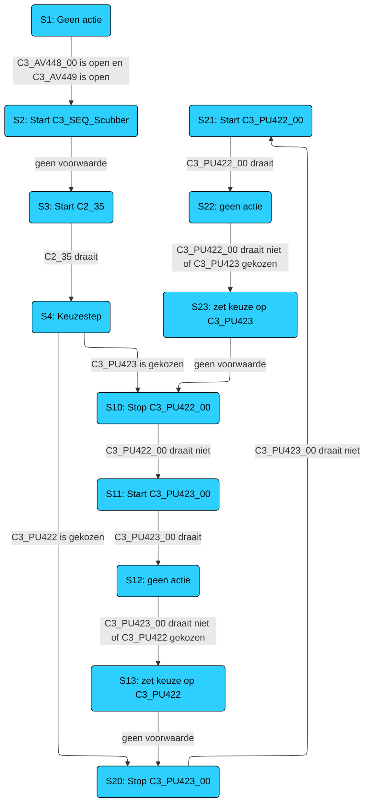
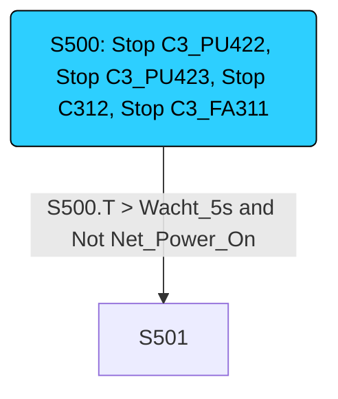

# Sequentie C3_SEQ_Water_Cooling

## ON-Sequentie
ON-Sequentie start automatisch vanuit `C3_SEQ_Main`

```mermaid
---
config:
  layout: elk
---

flowchart TB

%% bepaal classes
  classDef step fill: #2dcfff, stroke: #000000, color: #000000
    
S1("S1: Geen actie"):::step
S1 -- "C3_AV448_00 is open en C3_AV449 is open" --> S2

S2("S2: Start C3_SEQ_Scubber"):::step
S2 -- geen voorwaarde --> S3

S3("S3: Start C2_35"):::step
S3 -- C2_35 draait --> S4

S4("S4: Keuzestep"):::step
S4 -- C3_PU423 is gekozen --> S10
S4 -- C3_PU422 is gekozen --> S20

S10("S10: Stop C3_PU422_00"):::step
S10 -- "C3_PU422_00 draait niet" --> S11

S11("S11: Start C3_PU423_00"):::step
S11 -- "C3_PU423_00 draait" --> S12

S12("S12: geen actie"):::step
S12 -- "C3_PU423_00 draait niet of C3_PU422 gekozen" --> S13

S13("S13: zet keuze op C3_PU422"):::step
S13 -- "geen voorwaarde" --> S20

S20("S20: Stop C3_PU423_00"):::step
S20 -- "C3_PU423_00 draait niet" --> S21

S21("S21: Start C3_PU422_00"):::step
S21 -- "C3_PU422_00 draait" --> S22

S22("S22: geen actie"):::step
S22 -- "C3_PU422_00 draait niet of C3_PU423 gekozen" --> S23

S23("S23: zet keuze op C3_PU423"):::step
S23 -- "geen voorwaarde" --> S10


```

## OFF-Sequentie
OFF-Sequentie start automatisch vanuit `C3_SEQ_Main`

```mermaid
---
config:
  layout: elk
---

flowchart TB

%% bepaal classes
  classDef step fill: #2dcfff, stroke: #000000, color: #000000
    
S500("S500: Stop C3_PU422, Stop C3_PU423, Stop C312, Stop C3_FA311"):::step
S500 -- "S500.T > Wacht_5s and Not Net_Power_On" --> S501


```