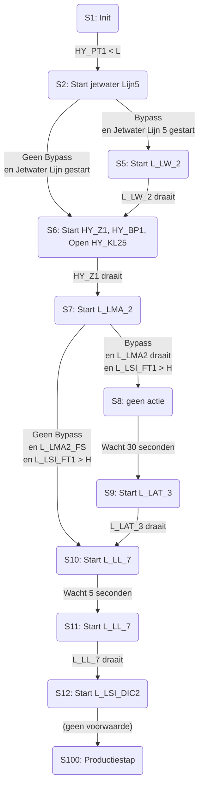

```mermaid
flowchart TB
S1(S1: Init)
S2(S2: Start jetwater Lijn5)
S5(S5: Start L_LW_2)
S6(S6: Start HY_Z1, HY_BP1, Open HY_KL25)
S7(S7: Start L_LMA_2)
S8(S8: geen actie)
S9(S9: Start L_LAT_3)
S10(S10: Start L_LL_7)
S11(S11: Start L_LL_7)
S12(S12: Start L_LSI_DIC2)
S100(S100: Productiestap)

S1 -- HY_PT1 < L --> S2
S2 -- Bypass
en Jetwater Lijn 5 gestart --> S5
S2 -- Geen Bypass
en Jetwater Lijn gestart --> S6
S5 -- L_LW_2 draait --> S6
S6 -- HY_Z1 draait --> S7
S7 -- Bypass
en L_LMA2 draait
en L_LSI_FT1 > H --> S8
S7 -- Geen Bypass
en L_LMA2_FS
en L_LSI_FT1 > H --> S10
S8 -- Wacht 30 seconden --> S9
S9 -- L_LAT_3 draait --> S10
S10 -- Wacht 5 seconden --> S11
S11 -- L_LL_7 draait --> S12
S12 -- (geen voorwaarde) --> S100
```
