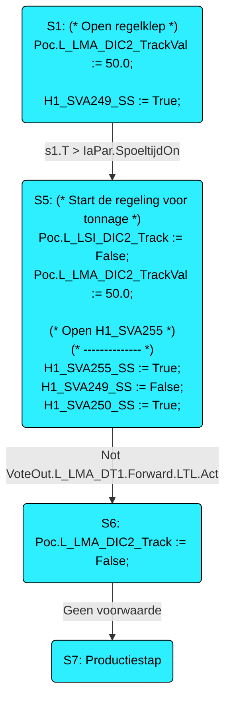
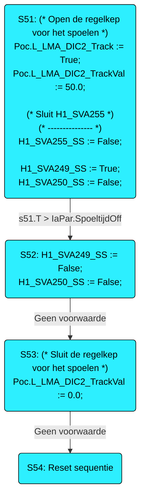

# Sequentie HY_SEQ_Ketel3_Spoelen_L5 😃

```mermaid
flowchart TB

%% bepaal classes
  classDef step fill: #2defff, stroke: #000000, color: #000000

S1("S1: (* Open regelklep *)
Poc.L_LMA_DIC2_TrackVal := 50.0;

H1_SVA249_SS := True;"):::step
S1 -- "s1.T > IaPar.SpoeltijdOn"--> S5

S5("S5: (* Start de regeling voor tonnage *)
Poc.L_LSI_DIC2_Track := False;
Poc.L_LMA_DIC2_TrackVal := 50.0;

(* Open H1_SVA255 *)
(* -------------- *)
H1_SVA255_SS := True;
H1_SVA249_SS := False;
H1_SVA250_SS := True;"):::step 

S5 -- "Not VoteOut.L_LMA_DT1.Forward.LTL.Act" --> S6
S6("S6: Poc.L_LMA_DIC2_Track := False;"):::step

S6 -- Geen voorwaarde --> S7
S7("S7: Productiestap"):::step


```

 
\pagebreak 

# OFF sequentie

```mermaid
flowchart TB

%% bepaal classes
  classDef step fill: #2defff, stroke: #000000, color: #000000

S51("S51: (* Open de regelkep voor het spoelen *)
Poc.L_LMA_DIC2_Track := True;
Poc.L_LMA_DIC2_TrackVal := 50.0;

(* Sluit H1_SVA255 *)
(* --------------- *)
H1_SVA255_SS := False;

H1_SVA249_SS := True;
H1_SVA250_SS := False;"):::step
S51 -- "s51.T > IaPar.SpoeltijdOff" --> S52

S52("S52: H1_SVA249_SS := False;
H1_SVA250_SS := False;"):::step

S52 -- Geen voorwaarde --> S53

S53("S53: (* Sluit de regelkep voor het spoelen *)
Poc.L_LMA_DIC2_TrackVal := 0.0;"):::step

S53 -- Geen voorwaarde --> S54
S54("S54: Reset sequentie"):::step

```

