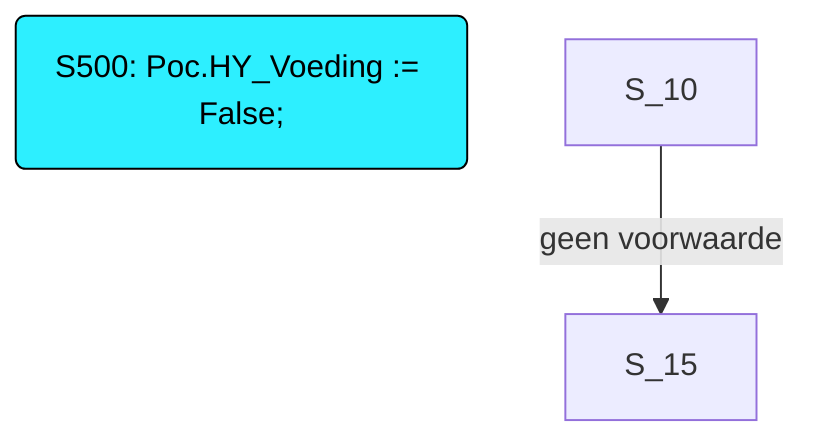

# Sequentie HY_SEQ_L1_2 😃
Sequentie wordt via faceplate gestart en gestopt.

```mermaid
flowchart TB

%% bepaal classes
  classDef step fill: #2defff, stroke: #000000, color: #000000

S1(S1: Disable alarmen van:
 HY_FT9_LL en HH, 
 HY_FT10_LL en HH,
 HY_FT11_LL en HH,
 HY_FT12_LL en HH,
 
Start Klasseerwater):::step
S1 -- "s1.T > Wacht_5S
en HY_PT2 > L (# klasseerwater #)
en S_SEQ_M31_Productiestap
en S_Lijn_1_2_Voeding
en (S_SEQ_M34_Productiestap Or IaPar.Indikker_M34.HY_M31_Buit_Keuze)
"--> S2

S2("S2: (* Vrijgave Water Regelaars voor M31 en M34 Sizer *)
Poc.HY_KlasWater_L1_2_M31 := true;"):::step
S2 -- Wacht 30 seconden --> S3

S3("S3: (* Vrijgave Water Regelaars voor M32 Sizer *)
Poc.HY_KlasWater_L1_2_M32 := True;"):::step
S3 -- Wacht 30 seconden --> S5

 S5("S5: (* HY_KL10 Dicht *)
Poc.HY_KL10_SV := False;

(* Instellen kleppen Als Maat de selectie is *)

If Comm.From_Silos_Vullen.SEQ_L12_DoelSilo >= 81 AND Comm.From_Silos_Vullen.SEQ_L12_DoelSilo <= 83 Then
      Poc.HY_KL30_SV := False;
      Poc.HY_KL31_SV := True;
Else
      Poc.HY_KL30_SV := True;
      Poc.HY_KL31_SV := False;
End_If;"):::step
S5 -- "(s5.T > Wacht_10m And IaPar.Pomptank_ZP39.HY_ZP39.StatStop) OR
(s5.T > Wacht_30S And IaPar.Pomptank_ZP39.HY_ZP39.StatRun)" --> S6

S6("S6: (* Start ZP38 *) 
poc.HY_ZP38_Start := true;"):::step
S6 -- "Poc.HY_ZP38_Run And 
s6.T > Wacht_30S And 
Poc.HY_Keuze_Z2 And 
Poc.HY_ZP38_Op" --> S7

S6 -- "Poc.HY_ZP38_Run And 
s6.T > Wacht_30S And 
Poc.HY_Keuze_Z1 And 
Poc.HY_ZP38_Op" --> S70

S7("S7: (* Start Z2 *)
poc.HY_Z2_Start := true;"):::step
S7 -- "Poc.HY_Z2_Run And 
s7.T > Wacht_5S And 
IaPar.Zeef_2.HY_LT2.GTH.Act" --> S8

S70("S70: (* Start Z2 *)
poc.HY_Z1_Start := true;"):::step
S70 -- "IaPar.Zeef_1.HY_Z1_StatRun And 
s70.T > Wacht_5S And 
IaPar.Zeef_1.HY_LT1.GTH.Act" --> S71

S71("S71: (* Open KL9 *)
poc.HY_KL7_SV := true;"):::step
S71 -- Wacht 5 seconden --> S8

S8("S8: (* Open KL9 *)
poc.HY_KL9_SV := true;"):::step
S8 -- "Wacht 5 seconden" --> S9

S9("S9: (* Open KL38 *)
poc.HY_KL38_SV := true;"):::step
S9 -- " S9_Open_HY_KL38.T > Wacht_10S and poc.HY_KL38_Open" --> S10

S10("S10: (* Start pomp ZP_33 *)
poc.HY_ZP33_Start := true;

(* Start Jetwater *)
Poc.HY_JetWater_L1_2_Start := True;"):::step
S10 -- " Poc.HY_ZP33_Run And 
 Not IaPar.Indikker_M34.HY_ZP33.Value.LTLAct And 
 S10_Start_ZP_33.T > Wacht_30S And 
 Poc.HY_JetWater_L1_2_Gestart" --> S11

S11("S11: (* Start pomp ZP34 *)
poc.HY_ZP34_Start := true;
Poc.WV_LPD2_SSCmd.Fwd.S1 := S11.X;

(* Start HY_BP1 aanpassing 4/11/21 WIHO *)
(* Als sequentie gestart wordt moet ook HY_BP1 gestart worden *)
 Poc.HY_BP1_Start := True;"):::step

S11 -- "Poc.HY_ZP34_Run 
And Not IaPar.Pomptank_ZP34.HY_ZP34.Value.LTLAct 
And s11.T > Wacht_30S 
And (Comm.From_Silos_Vullen.SEQ_L12_DoelSilo >= 1 AND Comm.From_Silos_Vullen.SEQ_L12_DoelSilo <= 33)" --> S12

S11 -- "Poc.HY_ZP34_Run 
And Not IaPar.Pomptank_ZP34.HY_ZP34.Value.LTLAct 
And s11.T > Wacht_30S 
And Comm.From_Silos_Vullen.SEQ_L12_DoelSilo >= 81 AND Comm.From_Silos_Vullen.SEQ_L12_DoelSilo <= 83" --> S75

S12("S12: Geen actie"):::step
S12 -- Geen voorwaarde --> S13

S75("S75: Start HY_ZP32"):::step
S75 -- Wacht 5 seconden --> S76

S76("S76: Start HY_ZP32"):::step

S76 -- "HY_ZP32 draait en stroom HY_ZP32> L en wacht 30 seconden" --> S13

S13("S13: Enable alarmen van:
 HY_FT9_LL en HH, 
 HY_FT10_LL en HH,
 HY_FT11_LL en HH,
 HY_FT12_LL en HH,

Start HY_ZP30"):::step

S13 -- "(HY_ZP30 draait en stroom van HY_ZP30 > L en wacht 30 seconden) Or M31 keuze = buiten" --> S14

S14("S14: (* Start Seq_M31 *)
S_SEQ_M31_On := True;

HY_ZP31_SS.Fwd.S1 := S14_Start_ZP31_en_Seq_M31.X;"):::step

S14 -- "Par.Lijn_M31.ZP31_StatRun And s14_Start_ZP31_en_Seq_M31.T > Wacht_30S" --> S15

S15("S15: (* Start Seq_M31 *)
(* ------------- *)
S_SEQ_M31_On := True;"):::step

S15 -- Wacht 15 seconden --> S16

S16("S16: (* Start ZP31 *)
(* ---------- *)
HY_ZP31_SS.Fwd.S1 := S16.X;"):::step

S16 -- "HY_ZP31_SS.Rev.X AND HY_ZP31_SS.Rev.FB1 AND
S16.T > Wacht_30S AND
(DoelSilo_M31 = 1000 OR DoelSilo_M31 = 1001)" --> S50

S16 -- "(* Subsequentie voor het starten van H1_PU442 *)

HY_ZP31_SS.Rev.X AND HY_ZP31_SS.Rev.FB1 AND
S16.T > Wacht_30S AND
NOT (DoelSilo_M31 = 1000 OR DoelSilo_M31 = 1001)" --> S17

S17("S17: (* Open H1_SVA446 *)
(* -------------- *)
H1_SVA446_SS.Fwd.S1 := S17_Open_SVA446.X;"):::step

S17 -- "H1_SVA446_SS.Rev.X AND H1_SVA446_SS.Rev.FB1" --> S18

S18("S18: (* Start H1_PU442 *)
(* -------------- *)
H1_PU442_SS.Fwd.S1 := S18_Start_PU442.X;"):::step

S18 -- "H1_PU442_SS.Rev.X AND H1_PU442_SS.Rev.FB1" --> S50

S50("S50: geen actie"):::step
S50 -- "Wacht op doorstart." --> S51

S51("S51: (* Open KL_10 *)
poc.HY_KL10_SV := True;

(* Vrijgave voeding *)
Poc.HY_DIC1_Track := False;
Poc.HY_DIC2_Track := False;
Poc.HY_DIC3_Track := False;
Poc.HY_DIC4_Track := False;
Poc.HY_DIC9_Track := False;"):::step

S51 -- "Not IaPar.Zeef_2.HY_FT22.LTL.Act And s51.T > Wacht_5S" --> S52

S52("S52: (* Sluit KL_9 *)
Poc.HY_KL9_SV := False;
Poc.HY_Voeding := True;"):::step

S52 -- Geen voorwaarde --> S95

S95("S95: (* Omschakeling *)
(* ------------ *)
H1_SVA446_SS.Fwd.S0 := S95_Omschakeling.X AND (DoelSilo_M31 = 1000 OR DoelSilo_M31 = 1001);
H1_PU442_SS.Fwd.S0  := S95_Omschakeling.X AND (DoelSilo_M31 = 1000 OR DoelSilo_M31 = 1001);"):::step

S95 -- Wacht 2 seconden --> S96

S96("S96: (* Latch Silo Keuze *)
(* ---------------- *)
DoelSilo_Latch := Comm.From_Silos_Vullen.SEQ_L12_DoelSilo;"):::step

S96 -- "Geen voorwaarde" --> S100

S100("S100: Productiestap"):::step

S100 -- "Comm.From_Silos.SEQ_L12_Doorstart_HY" --> S101

S101("S101: Poc.HY_Voeding := False;"):::step

S101 -- Wacht 10 seconden --> S102 

S102("S102: Poc.HY_DIC2_Track := True;
Poc.HY_DIC4_Track := True;")

S102 -- "Comm.From_Silos_Vullen.SEQ_L12_DoelSilo >= 1 
AND Comm.From_Silos_Vullen.SEQ_L12_DoelSilo <= 33
And s102.T > Wacht_20M" --> S103

S102 -- "Comm.From_Silos_Vullen.SEQ_L12_DoelSilo >= 81 
AND Comm.From_Silos_Vullen.SEQ_L12_DoelSilo <= 83 
And S102.T > Wacht_5M" --> S113

S103("S103: Poc.HY_ZP32_Start := False;
Poc.HY_ZP34_Start := False;
Poc.Doorstap_kleppen_Lijn1_2 := True;"):::step

S103 -- "S103_Stop_HY_ZP32_en_HY_ZP34.T > Wacht_5S" --> S104

S104("S104: (* Open HY_KL30 *)
(* ------------ *)
Poc.HY_KL30_SV := True;"):::step

S104 -- "IaPar.Pomptank_ZP34.HY_KL30.StatOpen" --> S105

S105("S105: Poc.HY_KL_ZP32_BW_SV := False;
Poc.HY_BP1_Start := False;
Poc.HY_KL31_SV := False;"):::step

S105("S105: S105.T > Wacht_30S 
(* AND IaPar.Silo.S_L12_M32_Productiestap *)
AND Comm.From_Silos.S_Lijn_1_2_Voeding
AND IaPar.Pomptank_ZP34.HY_KL31.StatClosed"):::step

S105 -- "S105.T > Wacht_30S 
(* AND IaPar.Silo.S_L12_M32_Productiestap *)
AND Comm.From_Silos.S_Lijn_1_2_Voeding
AND IaPar.Pomptank_ZP34.HY_KL31.StatClosed" --> S106

S106("S106: Poc.HY_ZP34_Start := True;
Poc.Doorstap_kleppen_Lijn1_2 := False;"):::step

S106 -- "Poc.HY_ZP34_Run And 
Not IaPar.Pomptank_ZP34.HY_ZP34.Value.LTLAct And 
s106.T > Wacht_30S" --> S120

S113("S113: Poc.HY_BP1_Start := True;
Poc.HY_KL31_SV := True;
Poc.Doorstap_kleppen_Lijn1_2 := True;"):::step

S113 -- "IaPar.Pomptank_ZP34.HY_KL31.StatOpen AND
IaPar.Bourage_Water.HY_BP1.StatRun" --> S114

S114("S114: Poc.HY_ZP34_Start := False;
Poc.HY_BP1_Start := True;
Poc.HY_KL30_SV := False;
Poc.HY_KL31_SV := True;"):::step

S114 -- "S114.T > Wacht_30S 
AND Iapar.Bourage_Water.HY_BP1.StatRun 
(* AND IaPar.Silo.S_L12_M32_Productiestap *)
AND Comm.From_Silos.S_Lijn_1_2_Voeding
AND IaPar.Pomptank_ZP34.HY_KL30.StatClosed" --> S115

S115("S115: Poc.HY_KL_ZP32_BW_SV := True;
Poc.HY_ZP34_Start := True;"):::step

S115 -- "Poc.HY_ZP34_Run And 
Not IaPar.Pomptank_ZP34.HY_ZP34.Value.LTLAct And 
s115.T > Wacht_2M" --> S116

S116("S116: Poc.HY_ZP32_Start := True;
Poc.Doorstap_kleppen_Lijn1_2 := False;"):::step

S116 -- "Poc.HY_ZP32_Run And 
Not IaPar.Pomptank_ZP34.HY_ZP32.Value.LTLAct And 
s116.T > Wacht_30S " --> S120

S120("S120: Poc.HY_DIC2_Track := False;
Poc.HY_DIC4_Track := False;
Poc.HY_Voeding := True;"):::step

S120 -- "geen voorwaarde" --> S100

```

# OFF sequentie

```mermaid
flowchart TB

%% bepaal classes
  classDef step fill: #2defff, stroke: #000000, color: #000000

S500("S500: Poc.HY_Voeding := False;"):::step
S_10 -- geen voorwaarde--> S_15


```

