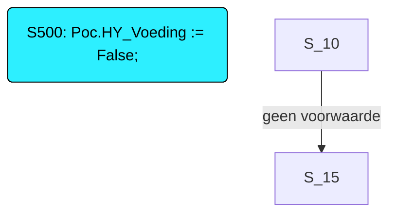

# Sequentie HY_SEQ_L3_4
Sequentie wordt via faceplate gestart en gestopt.

```mermaid
flowchart TB

%% bepaal classes
  classDef step fill: #2defff, stroke: #000000, color: #000000

S1("S1:
disable alarm HY_FT13 LL en HH
disable alarm HY_FT14 LL en HH
disable alarm HY_FT15 LL en HH
disable alarm HY_FT16 LL en HH

Seq Silo L34 kan/mag doorstappen

Start klasseerwater (HY_KP36, HY_KP36A, HY_KP37)

Enable voeding van zeef3"):::step

S1 -- "S1.T > Wacht_5S 
en HY_PT2 > L (druk klasseerwater)
en S_SEQ_L34 in Productiestap
en (S_SEQ_M34 in Productiestap Of knop HY_M31_Buit_Keuze is buiten)" --> S2  
%% Bestemming M34 is Silos of Keuze button Buiten 

S2("S2: enable Klasseerwater L34 M31"):::step
S2 -- "Wacht 30 seconden" --> S3

S3("S3: enable KlasseerWater L34 M32"):::step
S3 -- Wacht 30 seconden --> S4

S4("S4: Sluit HY_KL35"):::step
S4 -- "Wacht 5 seconden" --> S5

S5("S5: Sluit HY_KL12 (klep onder Zeef 3)"):::step

S5 -- "Als HY_ZP38 draait => Wacht 30 seconden
Als HY_ZP38 niet draait => Wacht 5 minuten" --> S6

S6("S6: Start HY_ZP39"):::step

S6 -- "Keuze = Zeef3
en HY_ZP39 draait
en Wacht 30 seconden" --> S7

S6 -- "Keuze = Zeef1 
en HY_ZP39 draait
en Wacht 5 seconden" --> S70

S7("S7: Start HY_Z3"):::step

S7 -- "HY_Z3 draait en Wacht 5 seconden en HY_LT3 > H" --> S8

S70("S70: Start HY_Z1"):::step

S70 -- "HY_Z1 draait en Wacht 5 seconden en HY_LT1 > H" --> S71

S71("S71: Open Klep HY_KL8"):::step

S71 -- "Wacht 5 seconden" --> S8

S8("S8: Open HY_KL11 (kleine klep onder Z3)"):::step

S8 -- Wacht 5 seconden --> S9

S9("S9: Open HY_KL38 (klep uitlaat indikker)"):::step

S9 -- "HY_KL38 is open en Wacht 10 seconden" --> S10

S10("S10: Start HY_ZP_33 en start Jetwater (=> Start JP2 en HY_PIC3)"):::step

S10 -- "HY_ZP33 draait en stroom HY_ZP38 > L (48A) en wacht 5 seconden en HY_PT3 > L (2 bar)" --> S11

S11("S11: enable alarm HY_FT13 LL en HH
enable alarm HY_FT14 LL en HH
enable alarm HY_FT15 LL en HH
enable alarm HY_FT16 LL en HH
Start WV_LPD2 (lagedruk pomp)
Start HY_BP1 (bourage pomp)"):::step

S11 -- "(Keuze_Silo_Beton_L34 of Keuze_Silo_Metaal_L34) en Wacht 5 seconden" --> S75
S11 -- "Keuze_Silo_Maat_L34 en wacht 5 seconden" --> S91

S75("S75: Open HY_KL35 en sluit HY_KL33"):::step

S75 -- "HY_KL35 is open en HY_KL33 is toe en wacht 10 seconden" --> S76

S76("S76: Start HY_ZP35"):::step

S76 -- "HY_ZP35 draait en stroom van HY_ZP35 > L (0A) en wacht 30 seconden" --> S77

S77("S77: Open HY_KL_ZP40_BW (klep bouragewater op HY_ZP40)"):::step

S77 -- "Wacht 5 seconden" --> S78

S78("S78: Start HY_ZP40"):::step

S78 -- "HY_ZP40 draait en stroom van HY_ZP40 > L (0A) en wacht seconden" --> S15

S91("S91: Open HY_KL33 en sluit HY_KL35"):::step

S91 -- "HY_KL33 is open, HY_KL35 is toe en wacht 10 seconden" --> S92

S92("S92: Start HY_ZP35"):::step

S92 -- "HY_ZP35 draait en stroom HY_ZP35 > L en wacht 30 seconden" --> S93

S93("S93: Sluit HY_KL31"):::step

S93 -- "Wacht 5 seconden" --> S94

S94("S94: Start HY_ZP32"):::step

S94 -- "HY_ZP32 draait en stroom HY_ZP32 > 0 en wacht 5 seconden" --> S15

S15("S15: Start S_Seq_M31"):::step

S15 -- "Wacht 10 seconden" --> S16

S16("S16: Start HY_ZP31"):::step

S16 -- "HY_ZP31 draait en wacht 30 seconden en (DoelSilo_M31 = 1000 Of DoelSilo_M31 = 1001)" --> S19

S16 -- "HY_ZP31 draait en wacht 30 seconden en (DoelSilo_M31 is niet 1000 en DoelSilo_M31 is niet 1001)" --> S17

S17("S17: Open H1_SVA446"):::step

S17 -- "H1_SVA446 is open" --> S18

S18("S18: Start H1_PU442"):::step

S18 -- "H1_PU442 draait" --> S19

S19("S19: Start HY_ZP30"):::step

S19 -- "(HY_ZP30 draait en stroom van HY_ZP30 > L en wacht 30 seconden) of (keuze = buiten)" --> S50

S50("S50: geen actie"):::step
S50 -- " Wacht op HY_L3_4_Doorstart" --> S51

S51("S51: Open HY_KL_12

Vrijgave voeding. Zet regelingen automatisch: HY_DIC5, HY_DIC6, HY_DIC7, HY_DIC8, HY_DIC9"):::step

S51 -- "HY_FT21 > L en wacht 5 seconden" --> S52

S52("S52: Sluit HY_KL_11"):::step

S52 -- "geen voorwaarde" --> S95

S95("S95: Omschakeling
Sluit H1_SVA446 als (DoelSilo_M31 = 1000 of DoelSilo_M31 = 1001)
Stop H1_PU442 als (DoelSilo_M31 = 1000 of DoelSilo_M31 = 1001)"):::step

S95 -- "Wacht 2 seconden" --> S100

S100("S100: Procuctiestap"):::step

S100 -- "Comm.From_Silos.SEQ_L34_Doorstart_HY (silo-type is niet gelijk)" --> S101

S101("S101: HY_Voeding (zeef3) afzetten ")
S101 -- "Wacht 10 seconden" --> S102

S102("S102: HY_DIC6 afzetten, HY_DIC8 afzetten
Poc.HY_Lijn_3_4_Doorstap_Silo := False;"):::step

S102 -- "(Keuze_Silo_Beton_L34 Or Keuze_Silo_Metaal_L34) en wacht 5 minuten" --> S63
S102 -- "Keuze_Silo_Maat_L34 en wacht 5 minuten" --> S83

S63("S63: geen actie"):::step
S63 -- "Wacht 15 minuten of HY_KL33 is toe" --> S64

S64("S64: Stop HY_ZP35, stop HY_ZP40, stop HY_ZP32
Poc.HY_Lijn_3_4_Doorstap_Silo := True;"):::step

S64 -- "Wacht 5 seconden" --> S65

S65("S65: Open HY_KL35, sluit HY_KL33, start HY_BP1, sluit HY_KL31

Poc.HY_KL_ZP32_BW_SV := False;
Poc.HY_KL_ZP40_BW_SV := False;"):::step

S65 -- "IaPar_Pomptank_ZP35.HY_KL35.StatOpen 
AND Comm.From_Silos.SEQ_L34_Productiestap 
AND S65.T > Wacht_5S" --> S66

S66("S66: Poc.HY_KL_ZP40_BW_SV := True;
Poc.HY_ZP35_Start := True;"):::step

S66 -- "Poc.HY_ZP35_Run And 
Not IaPar.Pomptank_ZP35.HY_ZP35.Value.LTLAct And 
s66.T > Wacht_5S" --> S67

S67("S67: Poc.HY_ZP40_Start := True;"):::step
S67 -- "Poc.HY_ZP40_Run And 
Not IaPar.Pomptank_ZP35.HY_ZP40.Value.LTLAct And 
s67.T > Wacht_5S" --> S59

S59("S59: Poc.HY_DIC6_Track:= False ;
Poc.HY_DIC8_Track:= False;
Poc.HY_Voeding := True;"):::step

S83("S83: Poc.HY_ZP40_Start := False;
Poc.HY_ZP35_Start := False;
Poc.HY_ZP32_Start := False;
Poc.HY_Lijn_3_4_Doorstap_Silo := True;"):::step

S83 -- "Wacht 5 seconden" --> S84

S84("S84: Poc.HY_KL35_SV := True;
Poc.HY_KL33_SV := False;
Poc.HY_BP1_Start := True;
Poc.HY_KL31_SV := False;

Poc.HY_KL_ZP32_BW_SV := False;
Poc.HY_KL_ZP40_BW_SV := False;"):::step

S84 -- "S84.T > Wacht_5S 
AND IaPar.Pomptank_ZP34.HY_KL31.StatClosed
AND IaPar.Pomptank_ZP35.HY_KL33.StatOpen
AND Comm.From_Silos.SEQ_L34_Productiestap" --> S85

S85("S85: Poc.HY_KL_ZP32_BW_SV := True;
Poc.HY_ZP35_Start := True;"):::step

S85 -- "Poc.HY_ZP35_Run And 
Not IaPar.Pomptank_ZP35.HY_ZP35.Value.LTLAct And 
s85.T > Wacht_2M" --> S86

S86("S86: Poc.HY_ZP32_Start := True;"):::step
S86 -- "IaPar.Pomptank_ZP34.HY_ZP32.StatRun And 
Not IaPar.Pomptank_ZP34.HY_ZP32.Value.LTLAct And 
s86.T > Wacht_5S" --> S59


```
# OFF sequentie

```mermaid
flowchart TB

%% bepaal classes
  classDef step fill: #2defff, stroke: #000000, color: #000000

S500("S500: Poc.HY_Voeding := False;"):::step
S_10 -- geen voorwaarde--> S_15


```

