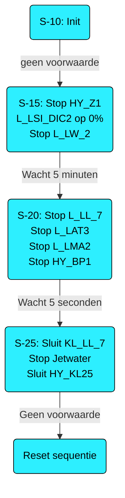

# Sequentie HY_SEQ_Lijn5 😃

```mermaid
flowchart TB

%% bepaal classes
  classDef step fill: #2defff, stroke: #000000, color: #000000

S1(S1: Init):::step
S1 -- geen voorwaarde--> S5

S5(S5: Start klasseerwater):::step
S5 -- HY_PT1 > L --> S10

S10(S10: Start Jetwater):::step
S10 -- Jetwater L5 is gestart --> S12

S12(S12: Start HY_BP1):::step
S12 -- HY_BP1 draait --> S15

S15(S15: Start L_LW_2):::step
S15 -- L_LW_2 draait --> S25

S25(S25: Start HY_Z1):::step
S25 -- HY_Z1 draait --> S30

S30(S30: Open HY_KL25):::step
S30 -- HY_KL is open --> S35

S35(S35: Start L_LMA_2):::step
S35 -- L_LMA_2 draait --> S40

S40(S40: Backup keuzes):::step
S40 -- geen voorwaarde --> S60

S60(S60: Keuze spiralen):::step
S60 -- zonder spiralen --> S70
S60 -- met spiralen --> S100

S70(S70: Open H1_SVA671):::step
S70 -- H1_SVA871 is open --> S80

S80(S80: Sluit H1_SVA801):::step
S80 -- H1_SVA801 is toe --> S114

S100(S100: Open H1_SVA815):::step
S100 -- H1_SVA815 is open --> S105

S105(S105: Open H1_SVA801):::step
S105 -- H1_SVA801 is open --> S110

S110(S110: Start H1_PU811):::step
S110 -- H1_PU811 draait --> S112

S112(S112: Sluit SVA671):::step
S112 -- SVA671 is toe --> S114

S114(S114: Start L_LAT3):::step
S114 -- L_LAT3 draait --> S115

S115(S115: Open HY_KL_LL7):::step
S115 -- HY_KL_LL7 is open --> S120

S120(S120: Start L_LL_7):::step
S120 -- L_LL7 draait --> S122

S122(S122: Start L_LSI_DIC2):::step
S122 -- L_LSI_DIC2 --> S125

S125(S125: Keuze):::step
S125 -- zonder spiralen --> S260
S125 -- met spiralen --> S140

S140(S140: Start H1_PU812):::step
S140 -- H1_PU812 draait --> S145

S145(S145: Keuze afval):::step
S145 -- Keuze afvalbuis --> S170
S145 -- Keuze L3+4 / Pomp 35 --> S148

S148(S148: Controle ZP35):::step
S148 -- HY_ZP35 draait --> S150

S150(S150: Open H1_SVA812):::step
S150 -- HY_SVA812 is open --> S160

S160(S160: Sluit H1_SVA811):::step
S160 -- H1_SVA811 is toe --> S165

S165(S165: Open H1_SVA812):::step
S165 -- H1_PU813 draait niet --> S300

S170(S170: Open H1_SVA811):::step
S170 -- H1_SVA811 is open --> S175

S175(S175: Start H1_PU813):::step
S175 -- H1_PU813 draait --> S180

S180(S180: Sluit H1_SVA812):::step
S180 -- H1_SVA812 is toe --> S300

S260(S260: Sluit H1_SVA801):::step
S260 -- H1_SVA801 is toe --> S265

S265(S265: Stop H1_PU811, H1_PU812, H1_PU813):::step
S265 -- pompen zijn gestopt --> S270

S270(S270: Sluit H1_SVA811, H1_SVA812, H1_SVA815):::step
S270 -- kleppen zijn toe --> S300

S300(S300: Productiestap):::step
S300 -- "(keuze_met_spiralen <> keuze_met_spiralen_latch)
or (keuze_afval <> keuze_afval_latch)" --> S310

S310("S310: Wacht op doorstappen"):::step
S310 -- "doorstappen geklikt" --> S5
```

# OFF sequentie

```mermaid
flowchart TB

%% bepaal classes
  classDef step fill: #2defff, stroke: #000000, color: #000000

S_10(S-10: Init):::step
S_10 -- geen voorwaarde--> S_15

S_15("S-15: Stop HY_Z1 <br>L_LSI_DIC2 op 0%<br>Stop  L_LW_2"):::step
S_15 -- Wacht 5 minuten --> S_20

S_20("S-20: Stop L_LL_7 <br>Stop L_LAT3 <br>Stop L_LMA2 <br>Stop HY_BP1"):::step
S_20 -- Wacht 5 seconden --> S_25

S_25("S-25: Sluit KL_LL_7 <br>Stop Jetwater <br>Sluit HY_KL25"):::step
S_25 -- Geen voorwaarde --> S_30

S_30("Reset sequentie"):::step
```

