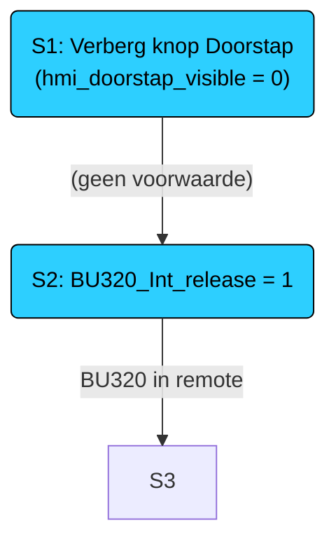

# Sequentie C3_Burner

# Buttons and variables

| Tag                       | Value                           | Comment                                                |
| ------------------------- | ------------------------------- | ------------------------------------------------------ |
| BU320_Reset               |                                 |                                                        |
| BU320_00_DIESEL_READY     |                                 |                                                        |
