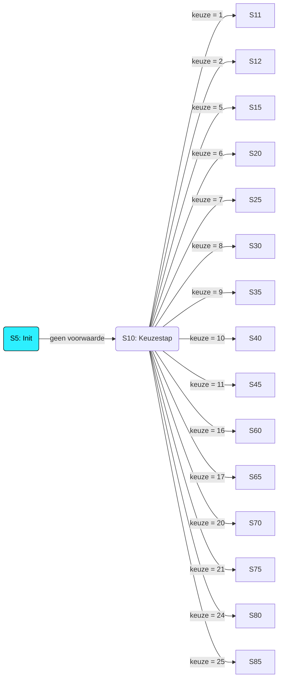
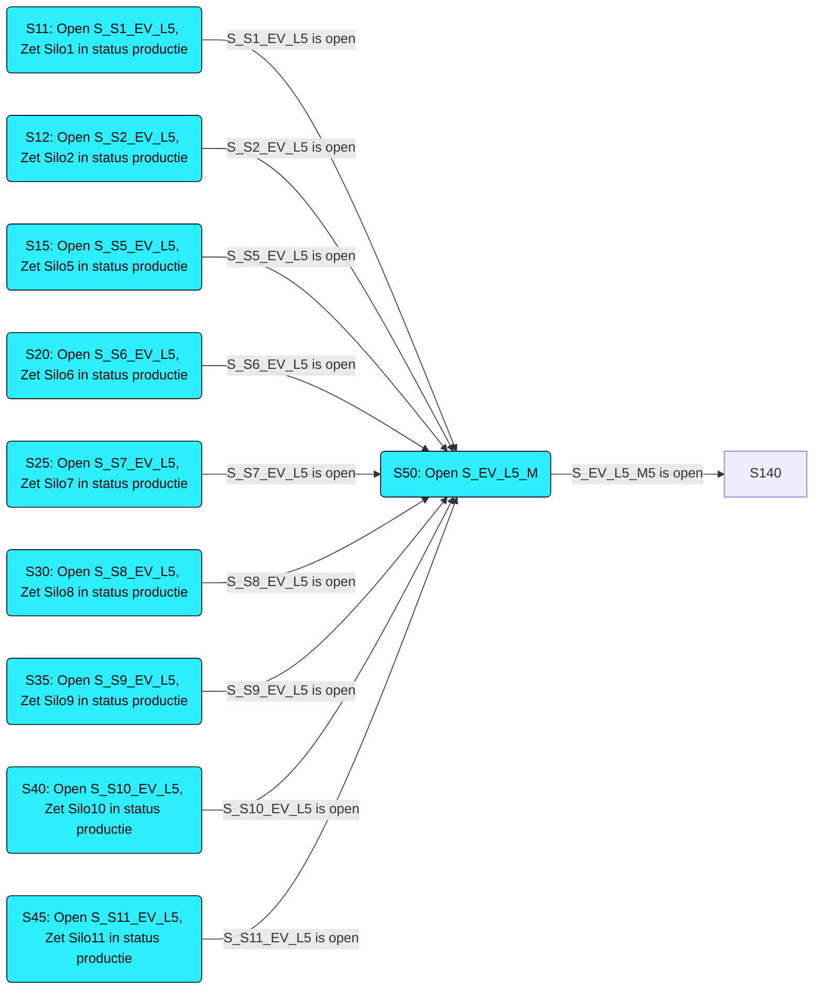
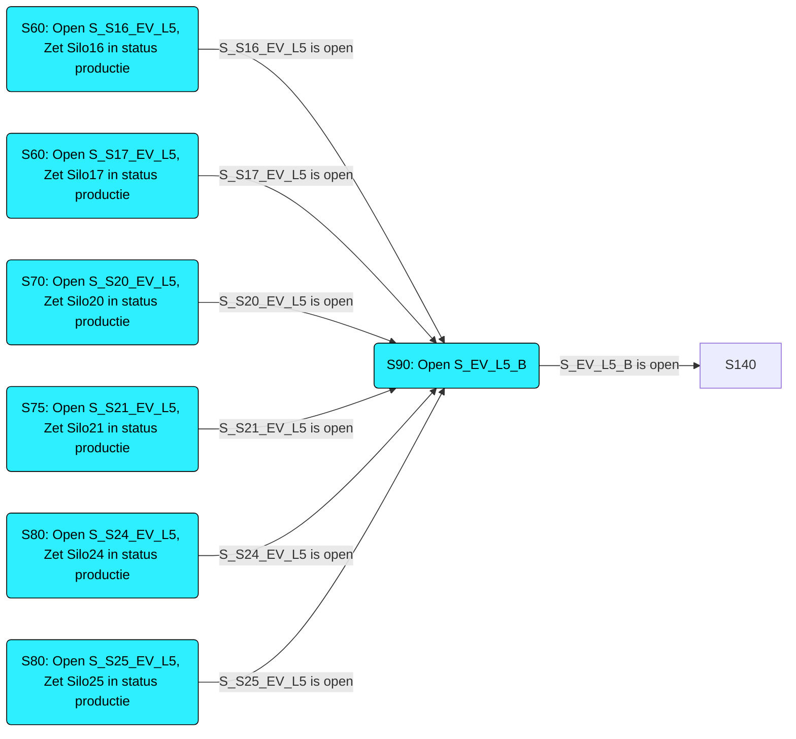
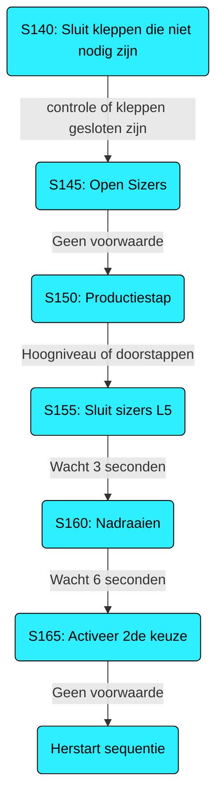
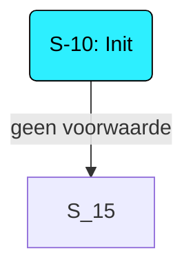

# Sequentie S_SEQ_L5

```mermaid
flowchart LR

%% bepaal classes
  classDef step fill: #2defff, stroke: #000000, color: #000000

S5(S5: Init):::step
S5 -- geen voorwaarde--> S10

S10("S10: Keuzestap")
S10 -- keuze = 1 --> S11
S10 -- keuze = 2 --> S12
S10 -- keuze = 5 --> S15
S10 -- keuze = 6 --> S20
S10 -- keuze = 7 --> S25
S10 -- keuze = 8 --> S30
S10 -- keuze = 9 --> S35
S10 -- keuze = 10 --> S40
S10 -- keuze = 11 --> S45
S10 -- keuze = 16 --> S60
S10 -- keuze = 17 --> S65
S10 -- keuze = 20 --> S70
S10 -- keuze = 21 --> S75
S10 -- keuze = 24 --> S80
S10 -- keuze = 25 --> S85
```

## S11 - S50

```mermaid
flowchart LR

%% bepaal classes
  classDef step fill: #2defff, stroke: #000000, color: #000000

S11(S11: Open S_S1_EV_L5, Zet Silo1 in status productie):::step
S11 -- S_S1_EV_L5 is open --> S50

S12(S12: Open S_S2_EV_L5, Zet Silo2 in status productie):::step
S12 -- S_S2_EV_L5 is open --> S50

S15(S15: Open S_S5_EV_L5, Zet Silo5 in status productie):::step
S15 -- S_S5_EV_L5 is open --> S50

S20(S20: Open S_S6_EV_L5, Zet Silo6 in status productie):::step
S20 -- S_S6_EV_L5 is open --> S50

S25(S25: Open S_S7_EV_L5, Zet Silo7 in status productie):::step
S25 -- S_S7_EV_L5 is open --> S50

S30(S30: Open S_S8_EV_L5, Zet Silo8 in status productie):::step
S30 -- S_S8_EV_L5 is open --> S50

S35(S35: Open S_S9_EV_L5, Zet Silo9 in status productie):::step
S35 -- S_S9_EV_L5 is open --> S50

S40(S40: Open S_S10_EV_L5, Zet Silo10 in status productie):::step
S40 -- S_S10_EV_L5 is open --> S50

S45(S45: Open S_S11_EV_L5, Zet Silo11 in status productie):::step
S45 -- S_S11_EV_L5 is open --> S50

S50(S50: Open S_EV_L5_M):::step
S50 -- S_EV_L5_M5 is open --> S140
```

## S60 - S90

```mermaid
flowchart LR

%% bepaal classes
  classDef step fill: #2defff, stroke: #000000, color: #000000

S60(S60: Open S_S16_EV_L5, Zet Silo16 in status productie):::step
S60 -- S_S16_EV_L5 is open --> S90

S65(S60: Open S_S17_EV_L5, Zet Silo17 in status productie):::step
S65 -- S_S17_EV_L5 is open --> S90

S70(S70: Open S_S20_EV_L5, Zet Silo20 in status productie):::step
S70 -- S_S20_EV_L5 is open --> S90

S75(S75: Open S_S21_EV_L5, Zet Silo21 in status productie):::step
S75 -- S_S21_EV_L5 is open --> S90

S80(S80: Open S_S24_EV_L5, Zet Silo24 in status productie):::step
S80 -- S_S24_EV_L5 is open --> S90

S85(S80: Open S_S25_EV_L5, Zet Silo25 in status productie):::step
S85 -- S_S25_EV_L5 is open --> S90

S90(S90: Open S_EV_L5_B):::step
S90 -- S_EV_L5_B is open --> S140
```

## S140 - S170

```mermaid
flowchart TB

%% bepaal classes
  classDef step fill: #2defff, stroke: #000000, color: #000000

S140("S140: Sluit kleppen die niet nodig zijn"):::step
S140 -- controle of kleppen gesloten zijn --> S145

S145("S145: Open Sizers"):::step
S145 -- "Geen voorwaarde" --> S150

S150("S150: Productiestap"):::step
S150 -- Hoogniveau of doorstappen --> S155

S155("S155: Sluit sizers L5"):::step
S155 -- Wacht 3 seconden --> S160

S160("S160: Nadraaien"):::step
S160 -- "Wacht 6 seconden" --> S165

S165("S165: Activeer 2de keuze"):::step
S165 -- "Geen voorwaarde" --> S170

S170("Herstart sequentie"):::step
```

# OFF sequentie

```mermaid
flowchart TB

%% bepaal classes
  classDef step fill: #2defff, stroke: #000000, color: #000000

S_10(S-10: Init):::step
S_10 -- geen voorwaarde--> S_15

```

