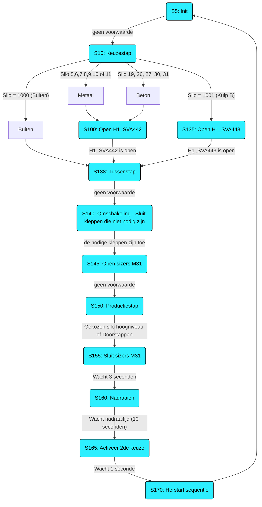
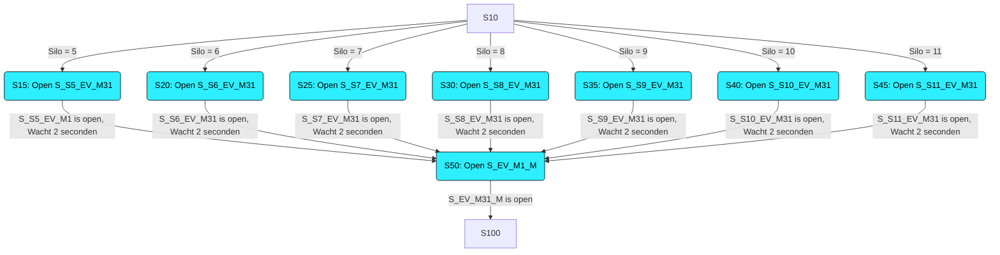
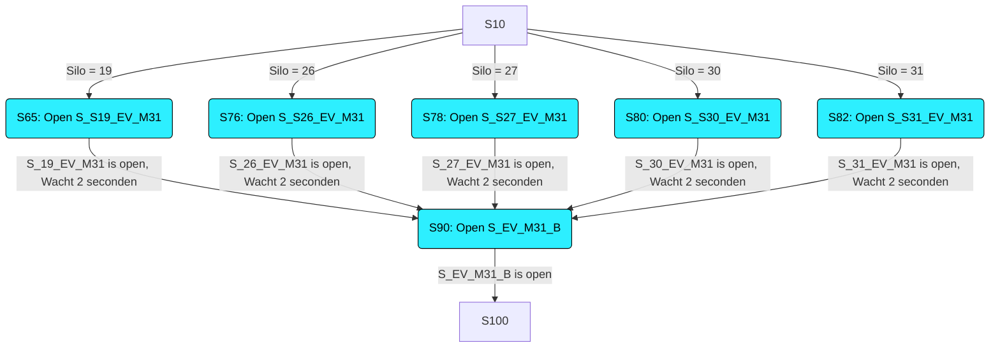
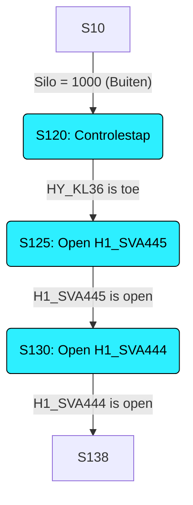
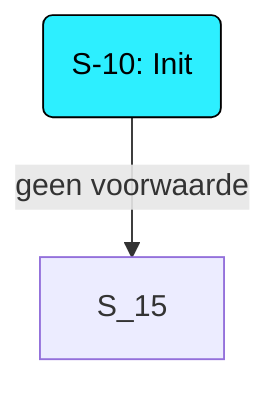

# Sequentie HY_SEQ_Lijn M31

## ON sequentie

```mermaid
flowchart TD

%% bepaal classes
classDef step fill: #2defff, stroke: #000000, color: #000000

S5(S5: Init):::step
S5 -- geen voorwaarde--> S10

S10(S10: Keuzestap):::step
S10 -- "Silo 5,6,7,8,9,10 of 11" --> Metaal
S10 -- "Silo 19, 26, 27, 30, 31" --> Beton

S10 -- "Silo = 1000 (Buiten)" --> Buiten
S10 -- "Silo = 1001 (Kuip B)" --> S135

Metaal --> S100
Beton --> S100
Buiten --> S138

S100("S100: Open H1_SVA442"):::step
S100 --"H1_SVA442 is open" --> S138

S135("S135: Open H1_SVA443"):::step
S135 -- "H1_SVA443 is open" --> S138

S138("S138: Tussenstap"):::step
S138 -- "geen voorwaarde" --> S140

S140("S140: Omschakeling - Sluit kleppen die niet nodig zijn"):::step
S140 -- "de nodige kleppen zijn toe" --> S145

S145("S145: Open sizers M31"):::step
S145 -- "geen voorwaarde" --> S150

S150("S150: Productiestap"):::step
S150 -- "Gekozen silo hoogniveau of Doorstappen" --> S155

S155("S155: Sluit sizers M31"):::step
S155 -- "Wacht 3 seconden" --> S160

S160("S160: Nadraaien"):::step
S160 -- "Wacht nadraaitijd (10 seconden)" --> S165

S165("S165: Activeer 2de keuze"):::step
S165 -- "Wacht 1 seconde" --> S170

S170("S170: Herstart sequentie"):::step
S170 --> S5
```

## Metalen Silos

```mermaid
flowchart TD

%% bepaal classes
  classDef step fill: #2defff, stroke: #000000, color: #000000
S10 -- "Silo = 5" --> S15
S10 -- "Silo = 6" --> S20
S10 -- "Silo = 7" --> S25
S10 -- "Silo = 8" --> S30
S10 -- "Silo = 9" --> S35
S10 -- "Silo = 10" --> S40
S10 -- "Silo = 11" --> S45

S15("S15: Open S_S5_EV_M31"):::step
S15 -- "S_S5_EV_M1 is open, Wacht 2 seconden" --> S50

S20("S20: Open S_S6_EV_M31"):::step
S20 -- "S_S6_EV_M31 is open, Wacht 2 seconden" --> S50

S25("S25: Open S_S7_EV_M31"):::step
S25 -- "S_S7_EV_M31 is open, Wacht 2 seconden" --> S50

S30("S30: Open S_S8_EV_M31"):::step
S30 -- "S_S8_EV_M31 is open, Wacht 2 seconden" --> S50

S35("S35: Open S_S9_EV_M31"):::step
S35 -- "S_S9_EV_M31 is open, Wacht 2 seconden" --> S50

S40("S40: Open S_S10_EV_M31"):::step
S40 -- "S_S10_EV_M31 is open, Wacht 2 seconden" --> S50

S45("S45: Open S_S11_EV_M31"):::step
S45 -- "S_S11_EV_M31 is open, Wacht 2 seconden" --> S50

S50("S50: Open S_EV_M1_M"):::step
S50 -- "S_EV_M31_M is open" --> S100
```

## Betonnen Silos

```mermaid
flowchart TD
classDef step fill: #2defff, stroke: #000000, color: #000000

S10 -- "Silo = 19" --> S65
S10 -- "Silo = 26" --> S76
S10 -- "Silo = 27" --> S78
S10 -- "Silo = 30" --> S80
S10 -- "Silo = 31" --> S82

S65("S65: Open S_S19_EV_M31"):::step
S65 -- "S_19_EV_M31 is open, Wacht 2 seconden" --> S90

S76("S76: Open S_S26_EV_M31"):::step
S76 -- "S_26_EV_M31 is open, Wacht 2 seconden" --> S90

S78("S78: Open S_S27_EV_M31"):::step
S78 -- "S_27_EV_M31 is open, Wacht 2 seconden" --> S90

S80("S80: Open S_S30_EV_M31"):::step
S80 -- "S_30_EV_M31 is open, Wacht 2 seconden" --> S90

S82("S82: Open S_S31_EV_M31"):::step
S82 -- "S_31_EV_M31 is open, Wacht 2 seconden" --> S90

S90("S90: Open S_EV_M31_B"):::step
S90 -- "S_EV_M31_B is open" --> S100

```

## Buiten

```mermaid
flowchart TB
classDef step fill: #2defff, stroke: #000000, color: #000000

S10 -- "Silo = 1000 (Buiten)" --> S120
S120("S120: Controlestap"):::step
S120 -- "HY_KL36 is toe" --> S125

S125("S125: Open H1_SVA445"):::step
S125 -- "H1_SVA445 is open" --> S130


S130("S130: Open H1_SVA444"):::step
S130 -- "H1_SVA444 is open" --> S138
```

## OFF sequentie

```mermaid
flowchart TB

%% bepaal classes
  classDef step fill: #2defff, stroke: #000000, color: #000000

S_10(S-10: Init):::step
S_10 -- geen voorwaarde--> S_15

```

