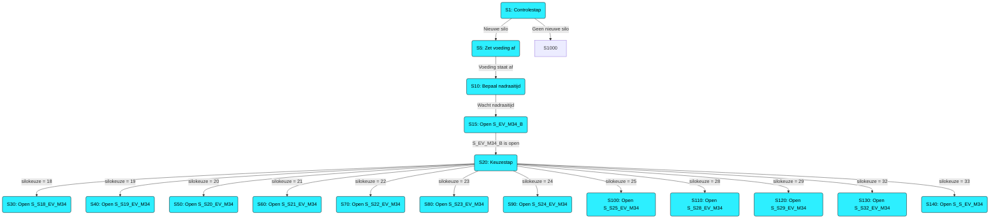
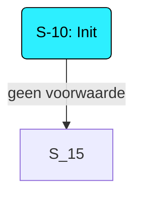

# Sequentie HY_SEQ_L1_2 😃

```mermaid
flowchart TB

%% bepaal classes
  classDef step fill: #2defff, stroke: #000000, color: #000000

S1(S1: Controlestap):::step
S1 -- Nieuwe silo --> S5
S1 -- Geen nieuwe silo --> S1000

S5(S5: Zet voeding af):::step
S5 -- Voeding staat af --> S10

S10(S10: Bepaal nadraaitijd):::step
S10 -- Wacht nadraaitijd --> S15

S15(S15: Open S_EV_M34_B):::step
S15 -- S_EV_M34_B is open --> S20

S20(S20: Keuzestap):::step
S20 -- silokeuze = 18 --> S30
S20 -- silokeuze = 19 --> S40
S20 -- silokeuze = 20 --> S50
S20 -- silokeuze = 21 --> S60
S20 -- silokeuze = 22 --> S70
S20 -- silokeuze = 23 --> S80
S20 -- silokeuze = 24 --> S90
S20 -- silokeuze = 25 --> S100
S20 -- silokeuze = 28 --> S110
S20 -- silokeuze = 29 --> S120
S20 -- silokeuze = 32 --> S130
S20 -- silokeuze = 33 --> S140

S30(S30: Open S_S18_EV_M34):::step

S40(S40: Open S_S19_EV_M34):::step

S50(S50: Open S_S20_EV_M34):::step

S60(S60: Open S_S21_EV_M34):::step

S70(S70: Open S_S22_EV_M34):::step

S80(S80: Open S_S23_EV_M34):::step

S90(S90: Open S_S24_EV_M34):::step

S100(S100: Open S_S25_EV_M34):::step

S110(S110: Open S_S28_EV_M34):::step

S120(S120: Open S_S29_EV_M34):::step

S130(S130: Open S_S32_EV_M34):::step

S140(S140: Open S_S_EV_M34):::step


```

# OFF sequentie

```mermaid
flowchart TB

%% bepaal classes
  classDef step fill: #2defff, stroke: #000000, color: #000000

S_10(S-10: Init):::step
S_10 -- geen voorwaarde--> S_15


```

