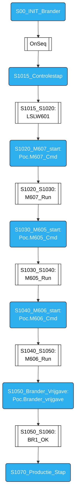
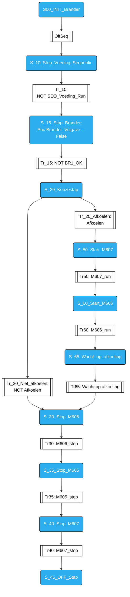
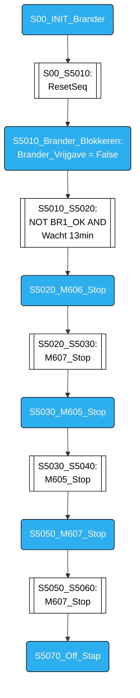

# MHL_S600_SEQ_Brander
>***On-sequentie***

```mermaid
graph TD

%% bepaal classes
    classDef init fill: #2daeef, stroke: #000000, color: #ffffff
    classDef tr fill: #ffffff, stroke: #000000, color: #000000 
    classDef step fill: #2daeef, stroke: #000000, color: #ffffff

%% stappen
INIT(S00_INIT_Brander):::init
S1015(S1015_Controlestap):::step
S1020(S1020_M607_start:
Poc.M607_Cmd):::step
S1030(S1030_M605_start:
Poc.M605_Cmd):::step
S1040(S1040_M606_start:
Poc.M606_Cmd):::step
S1050(S1050_Brander_Vrijgave:
Poc.Brander_vrijgave):::step
S1070(S1070_Productie_Stap):::step

%% overgangen
OnSeq[[OnSeq]]:::tr
Tr1015[[S1015_S1020: 
LSLW601]]:::tr
Tr1020[[S1020_S1030:
M607_Run]]:::tr
Tr1030[[S1030_S1040:
M605_Run]]:::tr
Tr1040[[S1040_S1050:
M606_Run]]:::tr
Tr1050[[S1050_S1060:
BR1_OK]]:::tr

%% stapvolgorde
INIT --> OnSeq --> S1015 --> Tr1015 --> S1020 --> Tr1020 --> S1030 --> Tr1030 --> S1040 --> Tr1040 --> S1050 --> Tr1050 --> S1070
```

>***Off-sequentie***

```mermaid
graph TD

%% bepaal classes
    classDef init fill: #2daeef, stroke: #000000, color: #ffffff
    classDef tr fill: #ffffff, stroke: #000000, color: #000000 
    classDef step fill: #2daeef, stroke: #000000, color: #ffffff

%% stappen
INIT(S00_INIT_Brander):::init
S_10(S_10_Stop_Voeding_Sequentie):::step
S_15(S_15_Stop_Brander:
Poc.Brander_Vrijgave = False):::step
S_20(S_20_Keuzestap):::step
S_30(S_30_Stop_M606):::step
S_35(S_35_Stop_M605):::step
S_40(S_40_Stop_M607):::step
S_45(S_45_OFF_Stap):::step
S_50(S_50_Start_M607):::step
S_60(S_60_Start_M606):::step
S_65(S_65_Wacht_op_afkoeling):::step

%% overgangen
OffSeq[[OffSeq]]:::tr
Tr_10[[Tr_10: 
NOT SEQ_Voeding_Run]]:::tr
Tr_15[[Tr_15: NOT BR1_OK]]:::tr
Tr_20a[[Tr_20_Niet_afkoelen:
NOT Afkoelen]]:::tr
Tr_20b[[Tr_20_Afkoelen:
Afkoelen]]:::tr
Tr_30[[Tr30: M606_stop]]:::tr
Tr_35[[Tr35: M605_stop]]:::tr
Tr_40[[Tr40: M607_stop]]:::tr
Tr_50[[Tr50: M607_run]]:::tr
Tr_60[[Tr60: M606_run]]:::tr
Tr_65[[Tr65: Wacht op afkoeling]]:::tr

%% stapvolgorde
INIT --> OffSeq --> S_10 --> Tr_10 --> S_15 --> Tr_15 --> S_20 --> Tr_20a --> S_30 --> Tr_30 --> S_35 --> Tr_35 --> S_40 --> Tr_40 --> S_45

S_20 --> Tr_20b --> S_50 --> Tr_50 --> S_60 --> Tr_60 --> S_65 --> Tr_65 --> S_30
```

>***Reset-sequentie***

```mermaid
graph TD

%% bepaal classes
    classDef init fill: #2daeef, stroke: #000000, color: #ffffff
    classDef tr fill: #ffffff, stroke: #000000, color: #000000 
    classDef step fill: #2daeef, stroke: #000000, color: #ffffff

%% stappen
INIT(S00_INIT_Brander):::init
S5010(S5010_Brander_Blokkeren:
Brander_Vrijgave = False):::step
S5020(S5020_M606_Stop):::step
S5030(S5030_M605_Stop):::step
S5050(S5050_M607_Stop):::step
S5070(S5070_Off_Stap):::step

%% overgangen
ResetSeq[[S00_S5010:
ResetSeq]]:::tr
Tr5010[[S5010_S5020:
NOT BR1_OK AND
Wacht 13min]]:::tr
Tr5020[[S5020_S5030:
M607_Stop]]:::tr
Tr5030[[S5030_S5040:
M605_Stop]]:::tr
Tr5050[[S5050_S5060:
M607_Stop]]:::tr

%% stapvolgorde
INIT --> ResetSeq--> S5010 --> Tr5010 --> S5020 --> Tr5020 --> S5030 --> Tr5030 --> S5050 --> Tr5050 --> S5070
```