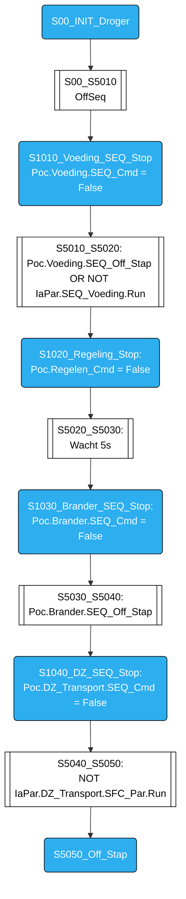

# MHL_S600_SEQ_Brander_OffSeq

```mermaid
graph TD

%% bepaal classes
    classDef init fill: #2daeef, stroke: #000000, color: #ffffff
    classDef tr fill: #ffffff, stroke: #000000, color: #000000 
    classDef step fill: #2daeef, stroke: #000000, color: #ffffff

%% stappen
INIT(S00_INIT_Droger):::init
S5010(S1010_Voeding_SEQ_Stop
Poc.Voeding.SEQ_Cmd = False):::step
S5020(S1020_Regeling_Stop:
Poc.Regelen_Cmd = False):::step
S5030(S1030_Brander_SEQ_Stop:
Poc.Brander.SEQ_Cmd = False):::step
S5040(S1040_DZ_SEQ_Stop:
Poc.DZ_Transport.SEQ_Cmd = False):::step
S5050(S5050_Off_Stap):::step

%% overgangen
OffSeq[[S00_S5010
OffSeq]]:::tr
Tr5010[[S5010_S5020: 
Poc.Voeding.SEQ_Off_Stap 
OR NOT IaPar.SEQ_Voeding.Run]]:::tr
Tr5020[[S5020_S5030:
Wacht 5s]]:::tr
Tr5030[[S5030_S5040:
Poc.Brander.SEQ_Off_Stap]]:::tr
Tr5040[[S5040_S5050:
NOT IaPar.DZ_Transport.SFC_Par.Run]]:::tr

%% stapvolgorde
INIT --> OffSeq --> S5010 --> Tr5010 --> S5020 --> Tr5020 --> S5030 --> Tr5030 --> S5040 --> Tr5040 --> S5050
```