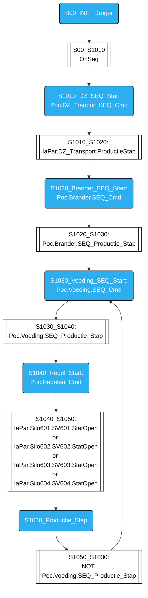

# MHL_S600_SEQ_Brander_OnSeq

```mermaid
graph TD

%% bepaal classes
    classDef init fill: #2daeef, stroke: #000000, color: #ffffff
    classDef tr fill: #ffffff, stroke: #000000, color: #000000 
    classDef step fill: #2daeef, stroke: #000000, color: #ffffff

%% stappen
INIT(S00_INIT_Droger):::init
S1010(S1010_DZ_SEQ_Start
Poc.DZ_Tranport.SEQ_Cmd):::step
S1020(S1020_Brander_SEQ_Start:
Poc.Brander.SEQ_Cmd):::step
S1030(S1030_Voeding_SEQ_Start:
Poc.Voeding.SEQ_Cmd):::step
S1040(S1040_Regel_Start:
Poc.Regelen_Cmd):::step
S1050(S1050_Productie_Stap):::step

%% overgangen
OnSeq[[S00_S1010
OnSeq]]:::tr
Tr1010[[S1010_S1020: 
IaPar.DZ_Transport.ProductieStap]]:::tr
Tr1020[[S1020_S1030:
Poc.Brander.SEQ_Productie_Stap]]:::tr
Tr1030[[S1030_S1040:
Poc.Voeding.SEQ_Productie_Stap]]:::tr
Tr1040[[S1040_S1050:
IaPar.Silo601.SV601.StatOpen
or IaPar.Silo602.SV602.StatOpen
or IaPar.Silo603.SV603.StatOpen
or IaPar.Silo604.SV604.StatOpen]]:::tr
Tr1050[[S1050_S1030:
NOT Poc.Voeding.SEQ_Productie_Stap]]:::tr

%% stapvolgorde
INIT --> OnSeq --> S1010 --> Tr1010 --> S1020 --> Tr1020 --> S1030 --> Tr1030 --> S1040 --> Tr1040 --> S1050 --> Tr1050 --> S1030
```